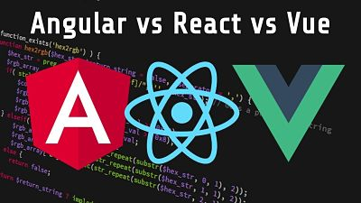
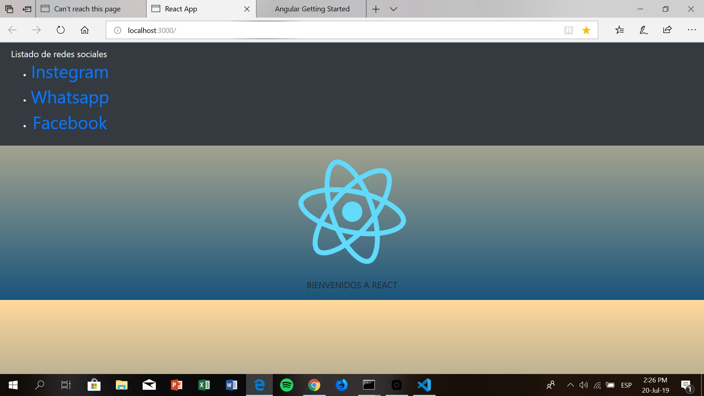
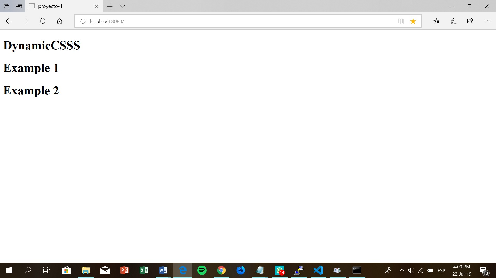

Hoy en dia los desarrolladores web buscan una comodidad mas eficiente y que sea rapida la hora de levantar una pagina que sea mas eficiente y rapida y muchas veces nos cuesta programar y poderlo plantear de esa forma pero ahora es posible hacerlo realidad.Como? Usando Frameworks que trabajen con SPA, aqui especificaremos 3 de ellos que son :
* ****Angular.js**** : Es una herramienta de desarrollo web programado con TypeScript y desarrollado por Google , con su objetivo principal que es aumentar las aplicaciones basadas al  Modelo Vista Controlador.
* ****React.js**** : Es una herramienta programado por Java Scrip y desarrollado por Facebook, con el objetivo de solo crear aplicaciones en una sola pagina usando patronese como MVC (Modelo-Vista-Controlador) o MVVM (Modelo-vista-modelo de vista). 
* ****Vue.js**** : Es una herramienta programada por Java Scrip y esta basada desde los dos frameworks anteriormente mencionados, extrayendo cosas interesante tanto en Angular que en React volviendolo mas liviano desarollado por Evan You, es lanzada recientemente este año por lo cual no tiene una comunidad de usuarios bastante grande pero cuenta con buenos criterios para aquellos que lo han familiarizado. 

**INTRODUCCION**

SPA es una página en donde todo el contenido está dentro de un solo archivo, es decir, solo se carga los archivos html,css y js una sola vez, esto hace que las paginas sea muy rápidas a la hora de cargar y hace más ágil la navegación entre ellos, existe casos en que se quiere cargar contenidos de forma dinámica, es decir, que se le pide al servidor que solo me muestre esa parte del contenido, los SPA están hecho en java script y tenemos muchas librerías y frameworks para hacer SPA, en este artículo señalaremos VEU.JS,ANGULAR.JS Y REACT.JS, las SPA solo requieren una API para mostrar el contenido del navegador web. Una página tradicional sirve para la indemnización en los buscadores de google para tu página web la mejor opción no es una spa sino optar por una página más tradicional.

**React.js** es una librería y divide los tres html, css y js por funcionalidad en la interfaz en un solo componente, por piezas  y  usa estas piezas por lo cual el código pueda ser reutilizado por ejemplo si yo quiero utilizar un mismo botón o logo simplemente lo reutilizo el que me genera determinado botón o logo. Su estructura es inseparable de la lógica, esto significa que tú puedes extraer el código de otro proyecto para generar uno nuevo y que no tengas que comenzar todo desde cero, también podemos indicar que los componentes se pueden combinar entre ellos para crear componentes mayores que a su vez se mezclan entre ellos y crean todo un sistema completo como la web, react.js ha desarrollado JSX que en pocas palabras es escribir html dentro de java script con la misma sintaxis, es fantástico y dominando react puedes hacer desarrollos para web,móvil y de escritorio.

**Angular.js** es un framework que hace uso del modelo vista controlador el cual define el uso de los componentes comunicándose entre sí para el manejo de la información para luego ser presentada en las vistas como html y css en lo cual angular.js facilita el flujo de esta comunicación, también evaluamos la capacidad que tiene entre angular con boostrap que es como su complemento por la asombrosa forma de adaptarse con los css y para poder usar angular.js necesitas tener experiencia con html5,css3 y java script que son indispensables. 
Se utiliza mucho en aplicaciones orientadas  a eventos como las que sucede en Java Script y son bastante fáciles a la hora de ponerlo en marcha, angular brinda herramientas necesarias para facilitar el trabajo y hacerlo mucho más sencillo y más optimizada. También nos permite la reutilización de códigos y no andar escribiendo códigos como locos. 

**Veu.js** utiliza una sintaxis de plantilla basada en HTML que permite vincular el DOM representado  los datos de la instancia de Vue subyacente, DOM le permite a Vue procesar su componente en su memoria antes de actualizar su navegador, lo que hace que todo sea más rápido porque hay menos interacciones con el navegador y si necesitas desarrollar cosas muy básicas Vue es perfecto y además los componentes de Vue amplían los elementos HTML básicos para encapsular el código reutilizable.

**CONTENIDO**

* _****React.js****_ nos sirve para hacer cosas a nivel visual, gestión de componentes y similares, pero no gestiona bien todo lo relacionado con la reactividad. 
React se puede utilizar como base en el desarrollo de aplicaciones de una sola página o móviles. Sin embargo, la obtención de datos es solo el comienzo de lo que sucede en una página web, por lo que las aplicaciones React complejas generalmente requieren el uso de bibliotecas adicionales para la administración del estado. 

<a href="https://es.reactjs.org/" target="_blank" rel="nofollow noopener noreferrer" class="external-link no-image">
  <strong>React.js</strong>
</a>

* **_Angular.js_** es un framework MVW para el frontend desarrollado por google con la finalidad de desarrollar aplicaciones web SPA, una de las ventajas que podemos decir de angular es la separacion entre frontedn y backend, es decir, se hara una web a nivel de frotend que no estara relacionado con el backend, si no que actuara de forma independiente y se comunicaran entre , existe muchas formas de usas angular.js por ejemplo encontramos en el modo de las vistas cuando construyamos los datos, que son la parte principal de nuestra aplicación y por existe los modelos y los controladores, otro uso es que nuestras vistas y modelos estan tienen bastante comunicación actualizando y modificando los datos, otro uso de angular..js es su compleja logica con el Java Script de tu aplicación.

<a href="https://angular.io//" target="_blank" rel="nofollow noopener noreferrer" class="external-link no-image">
  <strong>Angular.js</strong>
</a>

* _**Vue.js**_ Es un framework que  se ha convertido en uno de las alternativas mas importantes en el desarrollo web frontend entre sus caracteristicas es progresivo y esto tiene que ver con su complejidad, eso quiere decir que podemos usarlo para algo múy básico, igual que antes se usaba jQuery para cosas sencillas, o para algo más complejo como el desarrollo de una SPA, o para Server-Rendering.  Vue ha tomado de React los ciclos de vida de los componentes que son métodos que se van ejecutando a medida que la aplicación se ejecuta, esto es muy útil para cuando se hacen consultas a APIs externas o a bases de datos, también a tomado algunos conceptos del virtual DOM de React que básicamente sirve para realizar los cambios en ese DOM, luego compararlo con el verdadero y saber dónde se tiene que hacer el cambio sin tener que cambiar toda la aplicación.

 

<a href="https://vuejs.org/" target="_blank" rel="nofollow noopener noreferrer" class="external-link no-image">
  <strong>Vue.js</strong>
</a>

**COMPARACION O METODO**

El react.js tiene muchos usos no solo con frotend,  su ciclo de vida resulta muy útil cuando quiero consultar alguna librería o hacer una llamada AJAX,  saber en qué momento estoy del ciclo de vida del componente, acceder a él y hacer los cambios o llamadas que necesite, eso lo tiene Ract y Vue , y ambos trabajan de forma similar y esto no te requiere de mucho tiempo solo cambia un poco en cuanto a los nombre de los métodos, react se puede usar en aplicaciones nativas como en androide o en ios, puedes crear banked y puede hasta hacer realidad aumentada e incluso aplicaciones de escritorio, es la más usada por los programadores y empresas. En comparación con Angular que su tecnología es bastante difícil y necesita tiempo para estudiarla  poderla dominar, podemos hacer paginas súper reactivas y que no recarga el navegador en ningún momento y se sincroniza con AJAX nos facilita mucho poder trabajar sin recargar nuestra página web, en comparación con veu.js que es algo poca peculiar angular.js tiene una comunidad mundial enorme y cualquier cosa o dude lo encuentras enseguida. Veu.js tiene una similitud en otros frameworks toma un poco de cada uno de ellos y su orientación entre los componentes es bastante similar a la React y Angulas.js, en comparación entre Veu y Angular.js son sus directivas son muy similares al contrario con React donde utilizamos el componente render, Veu en comparación con angular y react trabaja con Vista Controlador utilizando html puro sumado sus directivas y el java script para su lógica, la arquitectura de react es más libre que la de Angular ya que se necesita seguir un patrón por lo cual angular tiene ciertas complicaciones que react que es óptimo y permite librarnos de ello.

**ANALISIS**

Usamos SPA en los distinto frameworks cuando queremos que nuestro sitio web abarque toda la información este un solo elemento y que se cargue rápido, en menos tiempo mejor y pueda tener una mejor experiencia con el usuario,  en lo que respecta a react.js si es posible implementarlo en SPA ya que se adapta a los requisitos de SPA y todos los componentes se juntan entre uno solo, Angular también  ha adaptado los principios de SPA generando nuevas páginas sin interrupciones al servidor y por ultimo Veu.js me permite usar SPA cuando quiero hacer aplicaciones más complejas de una forma sencilla y sus appis son muy fáciles y podemos enfocarnos en el código de las apps. Cuando usamos paginas tradicionales más lo usamos en el React porque es más libre y sencillo a la hora de establecer contenido.

**CONCLUSIONES**

Vue actualmente es sencillo de utilizar me ha parecido útil donde puedo crear contenidos de forma dinámica sin necesidad de instalar o configurar algo simplemente con los html+css+js puedo crear u componente más potente. Para mi todas las frameworks son útiles potentes y que tienen una gran acogida de usuarios por todo el mundo, todas son para el desarrollo de páginas web usando SPA y ninguna es peor que la otra, react me pareció más sencillo al agregar ciertas cosas que en angular es más complejo y en veu hay ciertas cosas más sencillas que en react. Yo escogería React para trabajar por su acogida y libre en implementar todo lo que quiera sin restricciones y utiliza muchas herramientas de OPenSource y crear con ella aplicaciones móviles 

A continuacion te mostrare ejemplos usando las 3 herramientas mencionadas anteriormente

###### _REACT.JS_

###### _ANGULAR.JS_

###### _Vue.jpg_

Tambien te dejo el archivo IEE si quieres descargarlo, espero que sea de tu agrado.

<a href="/inicio/frameworks-para-spa/Informe SPA frameworks.doc">Informe SPA frameworks.doc</a>

