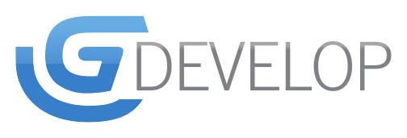
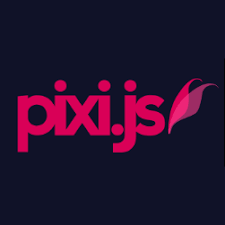
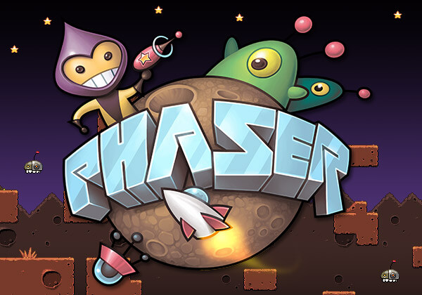
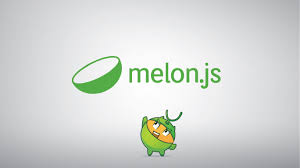

<time class="dt-published" datetime="2019-06-19T12:22:58-08:00">
<i class="fa fa-calendar"></i> 19th Jun 2019
</time>

###### ###### ###### Gdevelop

* GDevelop es un creador de juegos 
* Código abierto
* Multiplataforma   
* Permite desarrollar juegos en HTML5 
* No requiere tener conocimientos de programación
* Funciona en formato de ejecutable como Windos o Mac
* Es fácil de usar y lo suficientemente potente como para usuarios avanzados

###### Para que sirve?
Sirve para crear juegos en 2D con una facilidad impresionante, sin necesidad de conocer ningún lenguaje de programación y lo mejor de todo, es que el juego que se crea estará perfectamente personalizado para cumplir los requerimientos del creador.

<a href="https://www.ecured.cu/Game_Develop" target="_blank" rel="nofollow noopener noreferrer" class="external-link no-image">
  <strong>Mas informacion da clic</strong>
</a>

<a href="https://fr.wikipedia.org/wiki/GDevelop" target="_blank" rel="nofollow noopener noreferrer" class="external-link no-image">
  <strong>Mas informacion da clic</strong>
</a>

###### Ventajas y desventaja en Jump & Run

###### Ventajas
* Gran parte de su documentación es en español
* Se puede utilizar en Linux
* Crea juegos para dispositivos móviles

###### Desventajas
* Pesa mucho los programas

###### ###### ###### PixiJS

Pixi es un motor de renderizado 2D muy potente, lo que significa que te ayuda a mostrar y animar gráficos interactivos, lo que facilita la creación de juegos en javascript y HTML5.

###### Para que sirve?
Sirve para describir el diseño del juego en un gráfico de escena, y un representador, que realmente dibuja los elementos en la fase a la pantalla mediante el elemento canvas o WebGL. Incorpora Sprites que son basicamente imágenes que se pueden controlar con código, se puede controlar su tamaño posición y otras propiedades que lo hacen muy útil para hacer gráficos interactivos y animados. Saber utilizar los sprites es una de las cosas más importantes a la hora de desarrollar juegos con Pixi.

Este framework nos permite tres formas de crear los sprite:

* A partir de una imagen.
* A partir de una sub-imagen de un conjuto de imagenes denominado tileset(contiene todas las imágenes que necesitamos en nuestro juego).
* A partir de una textura atlas(un fichero JSON que define el tamñano y la posición de una imagen en un tileset).

<a href="https://ull-esit-sytw-1617.github.io/presentaciones-todos/juegos-en-js/pixijs.html" target="_blank" rel="nofollow noopener noreferrer" class="external-link no-image">
  <strong>Mas informacion da clic</strong>
</a>

<a href="https://www.pixijs.com/" target="_blank" rel="nofollow noopener noreferrer" class="external-link no-image">
  <strong>Link de descarga</strong>
</a>

###### Ventajas y desventaja en Jump & Run

###### Ventajas
* Tiene mayor cantidad de visitas en sus repositorios y si le estan dando mantenimiento
* Open Source.
* Gran comunidad
* Actualización diaria de ejemplos y nuevos juegos.
* Responsive.
* Facilidad de crear un juego en muy poco tiempo.
* Sistema de plugins.
* Todas las herramientas disponibles.
* Potente

###### Desventajas
* Alguna herramienta tiene algún pequeño error.
* Se puede quedar pequeño, dependiendo de la ambición del proyecto.

###### ###### ###### Phaser

Es un marco de juego 2D de codigo abierto para hacer juegos HTML5 para computadoras y móviles, que es desarrollado por Photon Storm.Los juegos se pueden compilar para iOS, Android y aplicaciones de escritorio nativas.Phaser tiene alto desarrollo con un paquete excelente y multiples herramientas que pueden ayudar a completar el desarrollo del juego de manera extremadamente rápida.

###### Para que sirve?
Pixi es una gran biblioteca de renderización rápida que se centra en Canvas y WebGL y sirve una serie de herramientas que acelerarán el desarrollo y te ayudaran a manejar las tareas genéricas necesarias para completar tu juego, para que así puedas concentrarte en la idea del juego en sí.

<a href="https://gamedevelopment.tutsplus.com/es/articles/how-to-learn-the-phaser-html5-game-engine--gamedev-13643" target="_blank" rel="nofollow noopener noreferrer" class="external-link no-image">
  <strong>Mas informacion da clic</strong>
</a>

<a href="http://phaser.io//" target="_blank" rel="nofollow noopener noreferrer" class="external-link no-image">
  <strong>Link de descarga</strong>
</a>

###### Ventajas y desventaja en Jump & Run

###### Ventajas
* Open Source
* La pre-carga de archivos
* Un editor visual para la creación facil de juegos
*  Es un buen framework, orientado principalmente a usuarios con conocimientos intermedios 

###### Desventajas
* No es del todo intuitivo el editor visual

###### ###### ###### melonJS
MelonJS es un motor de juegos HTML5 de código abierto que permite a los desarrolladores y diseñadores centrarse en el contenido, ademas carga de mapa de página sin comprimir, Base64, CSV y JSON codificada XML

###### Para que sirve?
melonJS sirve para integrar el popular formato de mapa en mosaico, lo que permite a los diseñadores crear niveles fácilmente con el editor de mapas en mosaico, y centrarse en las características del juego en sí.

<a href="https://www.javascripting.com/view/melonjs" target="_blank" rel="nofollow noopener noreferrer" class="external-link no-image">
  <strong>Mas informacion da clic</strong>
</a>

<a href="http://www.melonjs.org/" target="_blank" rel="nofollow noopener noreferrer" class="external-link no-image">
  <strong>Link de descarga</strong>
</a>

###### Ventajas y desventaja en Jump & Run

###### Ventajas
* No tiene mucho mantenimiento
* Rapido
* Ligero

###### Desventajas
* No tiene muchas herramientas para el control de interfaces.

###### ###### ###### Babylon

Es un motor 3D en tiempo real que utiliza una biblioteca de JavaScript para mostrar gráficos 3D en un navegador web a través de HTML5 .Es bien conocido que WebGL requiere de muchas líneas de código para el despliegue de primitivas 3D dentro de una escena. 

###### Para que sirve?

Con WebGL  sirve para adquirir capacidades 3D al elemento Canvas para la mayoría de los navegadores, una de las herramientas 3D más interesantes, pero al mismo tiempo nada fácil de usar. Por ejemplo, para crear un juego se necesitan muchísimas capacidades adicionales como detección de colisiones, partículas y muchos efectos especiales, y todas estas cosas son las que han creado los programadores de Microsoft con Babylon.js.

<a href="http://html5facil.com/tips/babylon-js-motor-3d-basado-en-webgl-y-javascript/" target="_blank" rel="nofollow noopener noreferrer" class="external-link no-image">
  <strong>Mas informacion da clic</strong>
</a>

<a href="https://www.babylonjs.com//" target="_blank" rel="nofollow noopener noreferrer" class="external-link no-image">
  <strong>Link de descarga</strong>
</a>

###### Ventajas y desventaja en Jump & Run

###### Ventajas
* Rapido
* Sus programas son viables
###### Desventajas
* No tiene mucho mantenimiento

