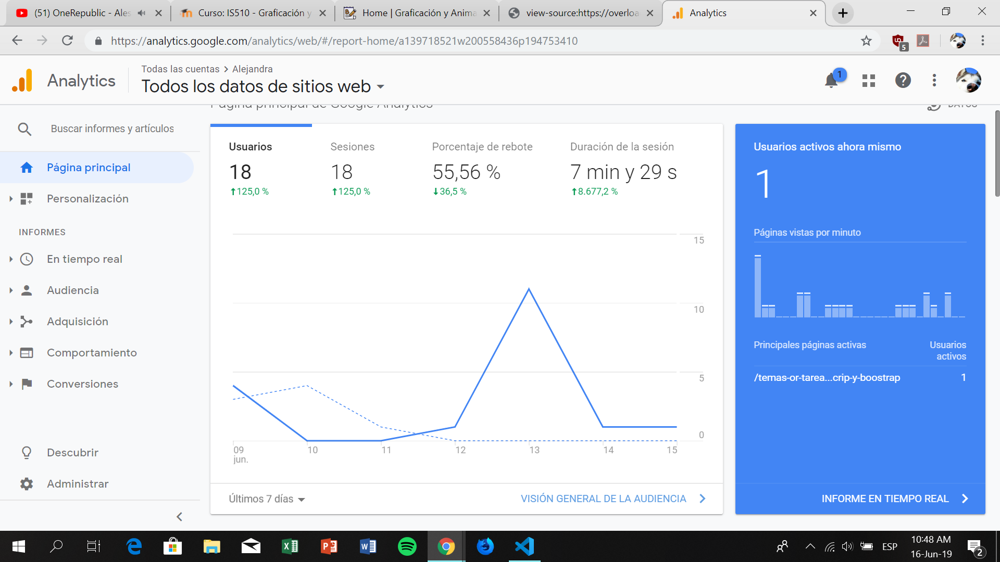

 
<time class="dt-published" datetime="2019-06-16T23:2:26-08:00">
<i class="fa fa-calendar"></i> 16th Jun 2019
</time>

###### Google analytic

Es una herramienta que te permite revisar y obtener informacion de cuantos usuarios han visitado tu pagina web ademas en que paises tambien estan localizados estos usuarios.

<a href="https://analytics.google.com/analytics/web/#/report-home/a139718521w200558436p194753410" target="_blank" rel="nofollow noopener noreferrer" class="external-link no-image">
  <strong>Link</strong>
</a>

