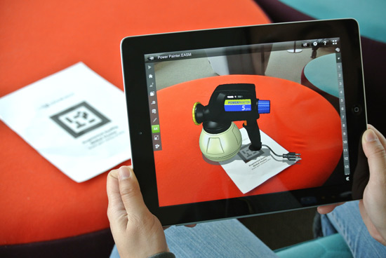

RA es el término que se usa para describir al conjunto de tecnologías que permiten que un usuario visualice parte del mundo real a través de un dispositivo tecnológico con información gráfica añadida por este dispositivo como celulares,tablest o laptop. Las capacidades de la realidad aumentada no terminan aquí, ya que la tecnología puede ser utilizada en una amplia variedad de aplicaciones, que van desde la medicina hasta el entretenimiento, y podemos indica una diferencia fundamental entre la tecnología de realidad aumentada y la realidad virtual reside en que mientras la primera de ellas agrega datos e información del contexto real al usuario, la segunda tecnología crea una realidad que no existe, pero siempre basándose en la posición y movimientos del usuario.

######  AR.JS
Es una libreria de Java Scrip que permite realizar  tu propia realidad aumentada de manera facil y sencilla y a continuacion te mostrare  un ejemplo.
Para visualizar necesitas tener activada la camara de tu telefono o laptop,si es con lapto acerca el marcador a la camara y si es el telefono acerca la camara al marcador.

<a href="https://alejandramontenegro.com/realidad/three.js/examples/mobile-performance.html" target="_blank" rel="nofollow noopener noreferrer" class="external-link no-image">
  <strong>clic</strong>
</a>

