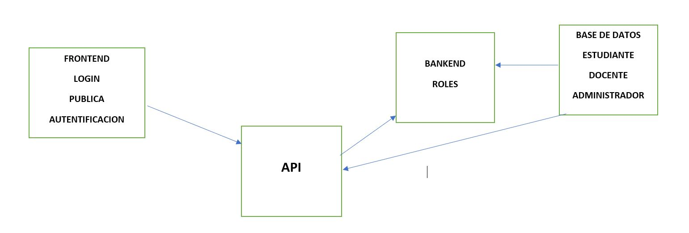

El proyecto a desarrollar planteo un esquema de como es en forma general y a continuacion indicare cuales son los pasos a seguir para que tenga un orden:
* Para el Banked que es la parte administrativa donde se definira una interfaz y que esta bajo el framework SPA React.js se definira lo siguiente:
1. Contruir una interfaz para establecer los reporte y listados de usuarios.
2. Utilizar los componentes para alterar los comportamiento de mi software y asi tener un control de errores de programacion.
3. Usar el software Express para el desarrollo de API donde incluye:

* Una vez creada una interfaz amigable para el usuario nos basamos en la creacion de la base de datos que tambien basa del banked, lo cual  me permitira la consulta de datos que yo necesite y asi poder hacer un login con los roles, se plantea lo siguiente:
1. Firebase es la base de datos que estara encargada de almacenar todos los datos necesarios, ademas que esta base de datos provee servicios y mucha documentacion con tecnicas ya probadas, ademas al usar ServerLess lo cual genera una API lo cual ahorra muchisimo el tiempo porque ya me genera con el banken ya hecha y que esta desarrollada en algun lenguaje por ejemplo Python, Node Js, etc.
2. Generar la base de datos Estudiante, Docente donde establecere informacion (Aula,Hora,Materia,Docente) en caso de ser Estudiante, (Aula,Hora,Materia) en caso de ser Docente.
3. Modelar herramientas que permita la doble autentificacion de usuarios y con esto conectarlo con el React.js.
4. Control de datos, para asegurar que los usuarios se me estan registrando en la base de datos.
5. La autentificacion debera estar ingresado en mi base de datos.

* Cuando ya tenemos realizado la parte del frontend y del bankend se comenzara a conectara para que asi la aplicacion este mas completa y para esto usaremos metodos que ya esten implementados por react.js y asi obtener respuestas si funciona y si da resultados positivos.

* Comenzaremos a desarrollar finalmente los marcadores de realidad aumentada usando AR.JS para esto se realizara lo siguiente:
1. Generar los marcardores ar.js con sus respectivos .patt
2. Obtener los datos del banked para mostrarlos en los marcadores.
3. Establecer la manera de como incluir los archivos.patt de los marcadores que habiliten el marcador e insertarlas en la parte publica de la aplicación
4. Introducir todos los arvhivos .patt en el lado del servidor
5. Generar en la parte administrativa una opcion que diga "generador de marcadores" y todos los laboratorios colocarlo en donde corresponde

