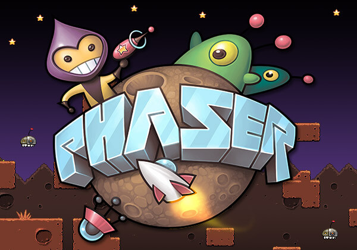

<time class="dt-published" datetime="2019-06-13T23:58:23-58:00">
  <i class="fa fa-calendar"></i> 24th Jun 2019
    </time>

Phaser es un Framework para la creacion de juegos, es uno de los primeros frameworks en lanzarse en este año y por lo cual es totalmente nuevo y esta en proceso, en esta practica tomamos un juego hecho por este framework y tuvimos que realizar ciertas modificaciones para que vea chevere y sea mas facil de usar. 

**Aqui te dejo el link para que lo juegues**

<a href="https://alejandramontenegro.com/user/game/t_hunter.html" target="_blank" rel="nofollow noopener noreferrer" class="external-link no-image">
  <strong>Link</strong>
</a>

