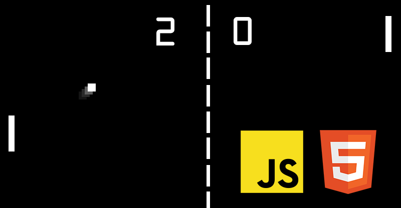

<time class="dt-published" datetime="2019-06-15T12:22:30-08:00">
<i class="fa fa-calendar"></i> 15th Jun 2019
</time>

Canvas es un elemento HTML el cual puede ser usado para dibujar gráficos usando scripts y no es algo muy díficil pero necesita saber y entender los aspectos básicos del HTML y JavaScript. No está soportado en navegadores viejos, pero están soportado en la mayoría de las versiones más recientes de los navegadores. El tamaño por defecto del canvas es 300px * 150px ancho (width) * alto (height). Pero se puede personalizar el tamaño usando las propiedades height y width de CSS. 

</a> <button onclick="location.href='https://alejandramontenegro.com/temas-or-tareas/escudo-ecuador'">Siguiente</button> <button onclick="location.href='https://alejandramontenegro.com/temas-or-tareas/relog-pero-invertido'">Anterior</button>